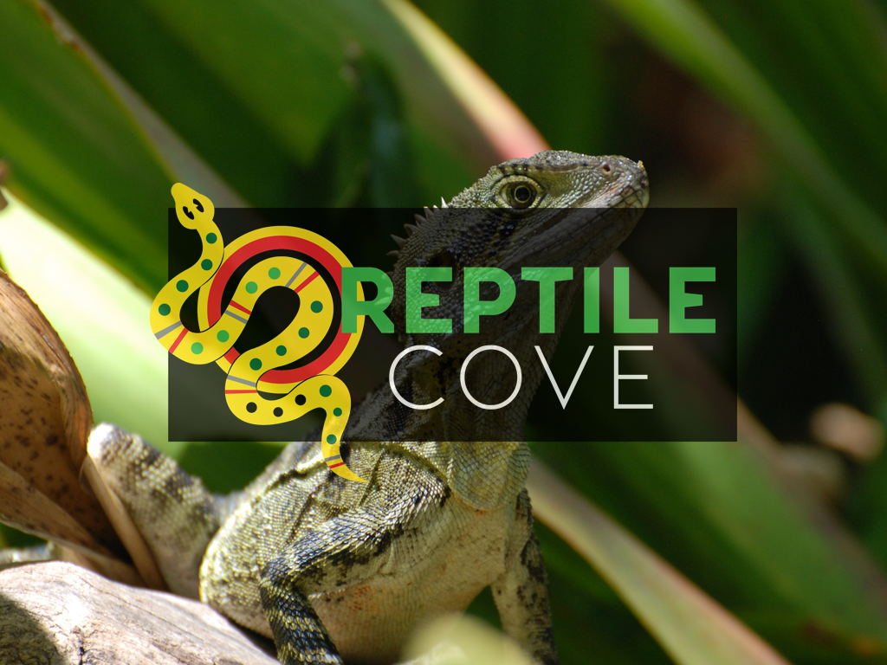
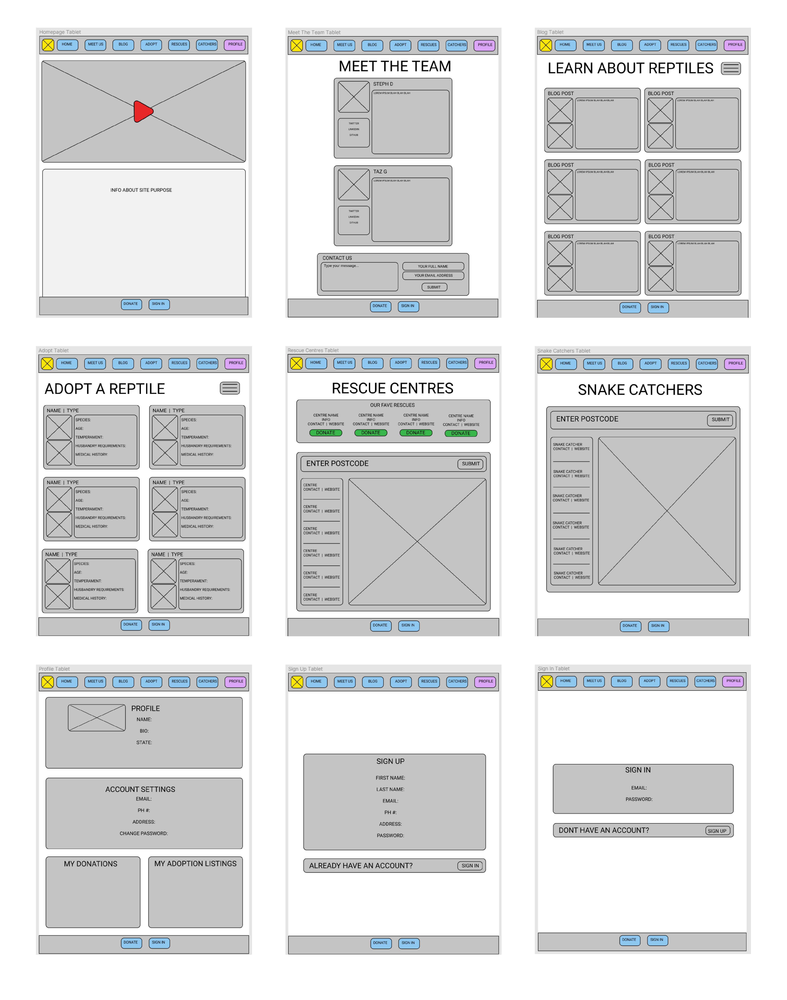
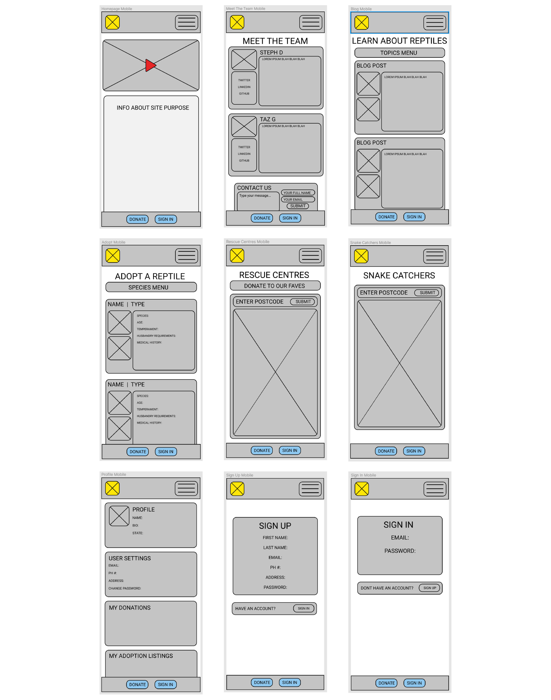
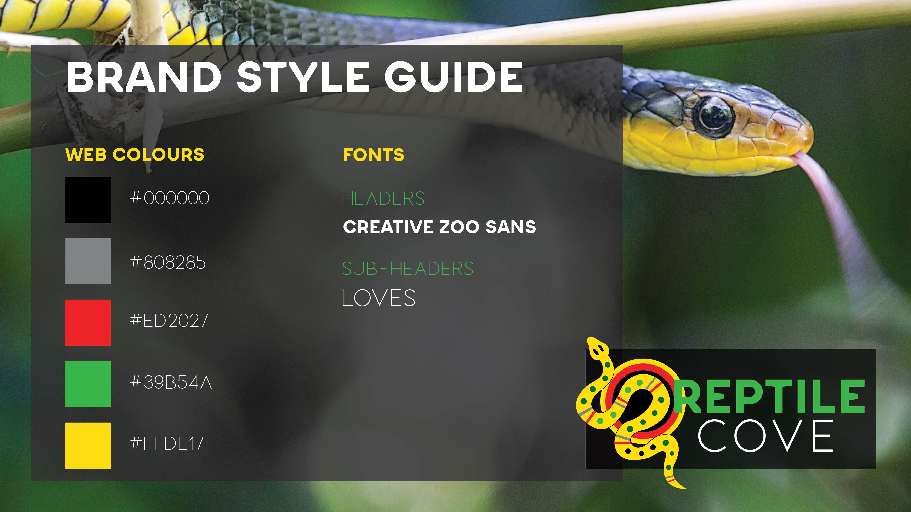

# Reptile Cove
T3A2-A Full Stack Application (Part A) | By Tanya Gibbs & Stephanie Duffieux | July 2020

* [Reptile Cove]() - Live Website
* [GitHub Repository](https://github.com/HeyitsmeTazG/ReptileCove)

## R1 Description of the Website

### Purpose

TBC

### Functionality/Features

##### "Home" Page
Welcomes the user to the website, includes a short video and purpose of the website. 

##### "Meet Us" Page
Introduces the user to the team behind Reptile Cove. The user can fill out a contact form if they wish to get in touch with the team.  

##### "Adopt a Reptile" Page
Users that are not signed in can view a list of reptiles available to adopt. A user must be signed in to enquire and adopt a reptile.  

##### "Blog" Page
Users can view educational posts written by Reptile Cove's admin team. An admin user can log in and update blog posts or add new blog posts.

##### "Snake Catchers" Page

Users can find snake catchers in their local region by entering their postcode which will give them a list of their nearest catchers. 

##### "Rescues" Page

Shows a list of rescue centres. Each rescue centre has a "Make a Donation" feature button allowing a user to make donations. 

##### Profile Page

When a user is logged in they can view their profile page which includes a history of their donations.

##### Footer

Includes a "Donate" button which directs the user to the "Rescues" page and a Sign In/Sign Out button.

### Target Audience

##### Demographic

* Primary school to high school students

Reptile Cove seeks to attract an audience of primary to high school students and aims to educate and raise awareness through educational blog posts on the role they can play from a young age in protecting Australia's native reptile species.

* Young to middle age adults 

Reptile Cove seeks to attract an audience of young to middle age adults who are passionate about reptiles  and want to contribute to protecting them through donations and adoptions. Reptile Cove also aims to educate its adult demographic on the importance and crucial role they can play in saving Australia's native reptile species.  

### Tech Stack

* MERN Stack (MongoDB, Express, React, Node)
* GitHub
* Visual Studio Code
* HTML5
* CSS3
* Bootstrap (frontend styling)
* Heroku (deployment platform)
* Cloudinary (Cloud storage)
* Stripe (third party payment system)
* Adobe Illustrator (Logo vector art)
* Adobe Photoshop (image resizing)
* Figma (draft wireframes)
* Adobe XD (wireframe mockups)
* Unsplash (free stock images)
* Trello.com (project management, user stories)
* Keynote (Slide deck presentation)

## R2 Dataflow Diagram

TBC

## R3 Application Architecture Diagram

TBC

## User Stories 

## Wireframes

### Desktop

### Tablet

### Mobile

## Style Guide

## Screenshots of Trello Board

[View Live Trello Board](https://trello.com/b/cBMk0jEf/reptile-cove)

#### Initial Stage - 11/07/2020

#### Progress - 12/07/2020

